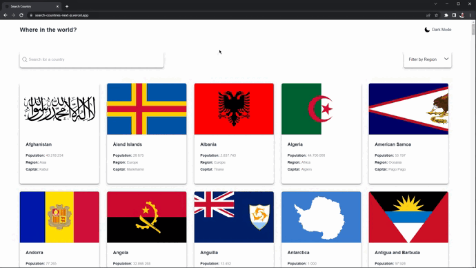

# Frontend Mentor - REST Countries API with color theme switcher solution

This is a solution to the [REST Countries API with color theme switcher challenge on Frontend Mentor](https://www.frontendmentor.io/challenges/rest-countries-api-with-color-theme-switcher-5cacc469fec04111f7b848ca). Frontend Mentor challenges help you improve your coding skills by building realistic projects. 

## Table of contents

- [Overview](#overview)
  - [The challenge](#the-challenge)
  - [Screenshot](#screenshot)
  - [Links](#links)
- [My process](#my-process)
  - [Built with](#built-with)
  - [How to use the software?](#how-to-use-the-software)
  - [Continued development](#continued-development)
  - [Useful resources](#useful-resources)
- [Author](#author)

## Overview

### The challenge

Users should be able to:

- See all countries from the API on the homepage
- Search for a country using an `input` field
- Filter countries by region
- Click on a country to see more detailed information on a separate page
- Click through to the border countries on the detail page
- Toggle the color scheme between light and dark mode *(session saved on localhost)*

### Screenshot



### Links

- Solution URL: [Github](https://github.com/gustavomarim/search-countries-next.js)
- Live Site URL: [Vercel](https://search-countries-next-js.vercel.app/)

## My process

### Built with

- Semantic HTML5 markup
- CSS custom properties
- Flexbox
- CSS Grid
- Mobile-first workflow
- [React](https://reactjs.org/) - JS library
- [Next.js](https://nextjs.org/) - React framework
- [Tailwind CSS](https://tailwindcss.com/) - For styles
- Clean Code

### How to use the software

```bash
# Clone this repository
$ git clone https://github.com/gustavomarim/search-countries-next.js.git

# Access project folder in your bash
$ cd search-countries-next.js

# Install all dependencies
$ npm install

# Run the application in development mode
$ npm run dev

# The server will start on port:3000 - acesse <http://localhost:3000>
```

### Continued development

I want to continue studying good software development practices, learning more about componentization of elements, reuse of functions and methods

### Useful resources

There were so many references that I sought throughout the project that it would be too extensive to mention them without forgetting to mention someone. But sources like [Stack Overflow](https://stackoverflow.com/), [Tabnews](https://www.tabnews.com.br/), [Medium](https://medium.com/) and many other articles and documentation like [Next.js](https://nextjs.org/) itself, [Typescript](https://www.typescriptlang.org/) and [Javascript](https://developer.mozilla.org/pt-BR/) helped me throughout the development.

## Author

<a href="https://github.com/gustavomarim">
 
 <br />
 <sub><b>Gustavo Dantas</b></sub></a> <a href="https://github.com/gustavomarim" title="GitHub">🚀</a>


Feito com ❤️ por Gustavo Dantas 👋🏽

 [](https://www.linkedin.com/in/gustavodantasmarim/) 

Frontend Mentor - [@gustavomarim](https://www.frontendmentor.io/profile/gustavomarim)


